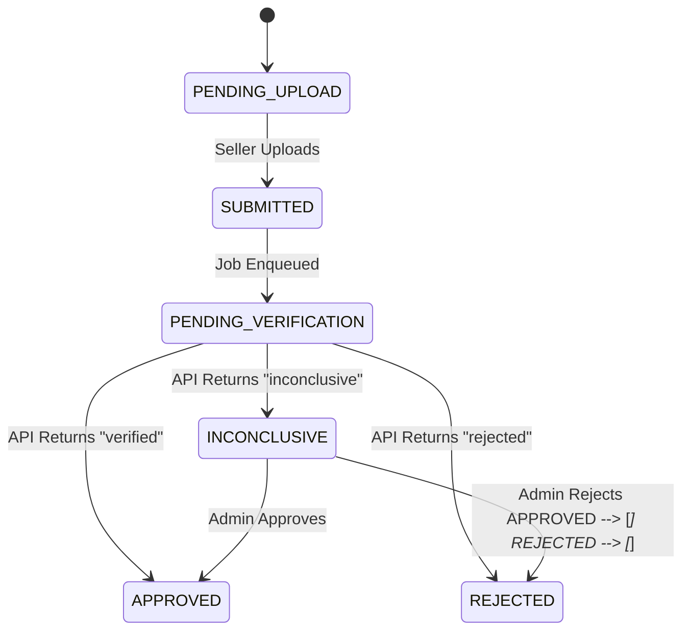

# Design document

## 1. Problem framing
The core problem for this feature of the platform is to balance between the truth, the verified and the user's convenience. The goal of the feature is to verify the identity of the seller, thus increase the legitimacy of the buyer in the seller and the platform's trustworthiness. Depend on the scale of the platform, the verification process could be simple or complex, strict or lenient, and can vary from a few requests per day to hundreds or thousands. 

The verification process should be designed in a way that it is efficient, effective, and user-friendly, while also ensuring the validity and accuracy of the information. If the process is too lengthy or complicated, it may discourage sellers from completing the verification, which could lead to a decrease in the number of verified sellers and a decrease in the overall trustworthiness of the platform. On the other hand, if the process is too lenient, it may allow fraudulent sellers to slip through, which could damage the reputation of the platform and lead to a loss of trust from buyers.

Stackholder and success:
- **Sellers**: They want to be verified quickly and easily so they can start selling. They also want to know the reason if their verification is rejected and have a chance to fix it.
- **Admin**: They want to only spend time on special cases, on case where manual actions are needed, on 'inconclusive' cases.
- **Platform**: They want the transparency. They want the trail, the audit so that if there's legal issue, they can provide the whole process: the documents, their verification, their current state (veried, rejected, in waiting for manual action...).

For that, the feature will not focus on:
- Document editor: There might be simple preview.
- Chat between users.
- The verification.

## 2. Clarifying Questions
- **What happens if two admins attempt to review the same "inconclusive" document simultaneously?**
    
    - _Why it changes the design:_ This dictates whether I need to implement pessimistic locking (locking the row when viewed) or optimistic locking (checking version timestamps on save).
        
- **What is our SLA/Retry Policy if the external verification service goes down completely?**
    
    - _Why it changes the design:_ It determines if a simple background job is enough, or if we need a robust queue with exponential backoff and a dead-letter queue.
        
- **Should notifications be in-app only, or do we require external channels (Email/SMS)?**
    
    - _Why it changes the design:_ Requires integrating a 3rd-party provider (e.g., SendGrid) and handling external notification failure states in the state machine.
        
- **Are there specific file format restrictions (e.g., PDF only) or size maximums?**
    
    - _Why it changes the design:_ Dictates the exact configuration of our backend Multer middleware and frontend validation logic to prevent malicious payload uploads.
        
- **Can an admin manually override a document that the system already marked as `APPROVED` or `REJECTED`?**
    
    - _Why it changes the design:_ This alters the "Terminal States" of the state machine. If overrides are allowed, those states are no longer strictly terminal.
        
- **How do we handle rate-limiting or spam if a rejected seller repeatedly uploads bad documents?**
    
    - _Why it changes the design:_ I would need to add an `attempts_count` to the `Seller` model or implement an API Gateway rate limiter to prevent abuse.
        
- **What are the data retention requirements for these PII (Personally Identifiable Information) documents?**
    
    - _Why it changes the design:_ If documents must be deleted after 90 days for GDPR, I need to design a scheduled cleanup cron job.
        
- **Does "full history" require taking snapshots of the physical file, or just logging the status changes?**
    
    - _Why it changes the design:_ Impacts storage architecture. Snapshots require duplicate S3 objects, whereas status tracking just requires a database log.

**Working Assumptions (to proceed with MVP):**

1. _Concurrency:_ I assume optimistic locking is sufficient. The first admin to submit a decision wins; the second gets a UI error.
    
2. _API Failures:_ I assume the external API is flaky. I will use a background worker with automatic retries rather than failing the document immediately.
    
3. _Storage:_ I assume local disk storage is acceptable for the MVP demo, though production would require secure AWS S3 buckets.

## 3. Architecture
State machine:

Data model
- **Sellers**: `id`, `email`, `company_name`.
    
- **Documents**: `id`, `seller_id`, `file_url`, `status` (Enum), `current_attempt_id`.
    
- **VerificationAttempts**: `id`, `document_id`, `provider_status`, `admin_id` (nullable), `admin_decision`, `reason`, `created_at`, `updated_at`.
    
- **AuditLogs**: `id`, `attempt_id`, `action_taken`, `performed_by` (System/Admin ID), `timestamp`.
## 4. Stack Decisions
- **Backend Framework: Node.js with Express (TypeScript)**
    
    - _Why:_ Express provides a lightweight, unopinionated foundation that allows for rapid MVP iteration while maintaining strict typing via TypeScript.
        
    - _Alternative Considered:_ NestJS. Rejected because its heavy reliance on decorators, dependency injection, and boilerplate is overkill for a 5-day, single-feature project.
        
- **Frontend Framework: Next.js (TypeScript)**
    
    - _Why:_ The App Router allows for easy role-based folder routing (e.g., `/seller` vs `/admin`) within a single monolithic repository, accelerating deployment.
        
    - _Alternative Considered:_ React SPA (Vite). Rejected because it requires manual configuration of routing and separate hosting infrastructure from the backend API.
        
- **Database: PostgreSQL**
    
    - _Why:_ The feature's core requirement is an immutable audit trail and state integrity. A relational database with strict foreign keys is non-negotiable for this level of transactional safety.
        
    - _Alternative Considered:_ MongoDB. Rejected because NoSQL document stores make joining complex audit logs and enforcing strict state transitions more error-prone.
        
- **Async Processing: pg-boss**
    
    - _Why:_ It leverages the existing PostgreSQL database to act as a robust job queue, meaning I don't have to provision or maintain additional infrastructure for this demo.
        
    - _Alternative Considered:_ BullMQ. Rejected solely because it requires standing up a separate Redis instance, which adds unnecessary deployment complexity for a short-term take-home project.

## 5. Trade-offs and Decisions
**1. Async Processing via pg-boss**

- **Alternatives considered:** `setTimeout` (too fragile, loses data on restart), BullMQ (requires spinning up a separate Redis instance).
    
- **Why I chose it:** Since the application already requires a PostgreSQL database for relational data, `pg-boss` allows us to leverage that existing infrastructure for our background queues. This reduces the number of moving parts for the MVP while still providing robust retry mechanisms.
    
- **Condition to change:** If the platform scales to millions of verification requests per day, the database would become a bottleneck, and I would migrate the queue to a dedicated message broker like AWS SQS or Kafka.

**2. File Storage Strategy**

- **Alternatives considered:** AWS S3, Google Cloud Storage.
    
- **Why I chose it:** For the sake of prototyping and the 5-day deadline, files are handled via Multer and stored on the local disk (or base64 encoded depending on the deployment environment constraints). This removes the overhead of configuring IAM roles and buckets for a demo.
    
- **Condition to change:** For production, local storage is unacceptable (especially on ephemeral container platforms like Render). This would be immediately swapped to an S3 bucket with signed URLs for secure access.

## 6. Failure Modes
- **The external verification service returns a malformed response:** The service layer catches the JSON parse error or schema validation failure, logs the raw payload for debugging, and transitions the document to `INCONCLUSIVE` so an admin can manually review it.
    
- **The service is unreachable for hours:** `pg-boss` will retry based on its backoff configuration. If it exhausts all retries (e.g., after 24 hours), the job fails permanently, and the document is moved to `INCONCLUSIVE` with a specific system flag noting the timeout, alerting the admin team.
    
- **Two admins review the same document simultaneously:** Due to our optimistic locking trade-off, the second admin to hit "Save" will receive an HTTP 409 Conflict error and a message stating, "This document has already been processed by another administrator."
    
- **The seller uploads a massive or malicious file:** The Express API uses Multer middleware to explicitly reject files over 10MB and strictly checks the MIME type before the file is ever written to disk or processed by the database.
    
- **Container Restart / Ephemeral Disk Wipe:** Because this demo may be deployed on a platform like Render with an ephemeral file system, any uploaded local files might disappear upon a server restart or deployment. The database state will remain, but the `file_url` might point to a missing asset.

## 7. Descoped Items
- **Cloud Object Storage (AWS S3):**
    
    - _Why:_ Overhead of setup for a take-home MVP.
        
    - _Adding it later:_ Replace the Multer local storage engine with `multer-s3` and stream uploads directly to a secure bucket.
        
    - _Risks:_ Ephemeral storage loss on the host server (as noted in Failure Modes).
        
- **Email/SMS Notifications:**
    
    - _Why:_ Requires setting up SendGrid/Twilio accounts and templates.
        
    - _Adding it later:_ Tie into the state machine's transition hooks. When transitioning to `APPROVED` or `REJECTED`, dispatch an event to a Notification Service.
        
    - _Risks:_ Sellers must manually refresh their dashboard to see status changes in this current iteration.

## 8. Implementation Plan
If I had a standard 2-week sprint to build this completely for production, the plan would be:

1. **Phase 1: Foundation & Infrastructure (Days 1-2)**
    
    - Set up the monorepo/split-repo with TypeScript, Express, and Next.js.
        
    - Provision PostgreSQL and apply the Prisma schema.
        
    - Configure CI/CD pipelines for deployment.
        
2. **Phase 2: Core State Machine & Async Queue (Days 3-5)**
    
    - Implement the Document and Audit Repository patterns.
        
    - Set up `pg-boss` for job queueing.
        
    - Build the internal Mock External Service and the background worker to consume it.
        
3. **Phase 3: Seller Flow (Days 6-7)**
    
    - Build the UI for document upload (Next.js).
        
    - Implement Multer middleware for secure file validation.
        
    - Build the status polling/dashboard for the Seller.
        
4. **Phase 4: Admin Flow (Days 8-10)**
    
    - Build the Admin UI to query `INCONCLUSIVE` documents.
        
    - Implement the manual override API endpoints.
        
    - Build the Audit History view for transparency.
        
5. **Phase 5: Hardening & Polish (Days 11-14)**
    
    - Migrate from local storage to S3.
        
    - Write E2E tests (Playwright) and API integration tests (Vitest).
        
    - Implement proper Auth and notification webhooks.