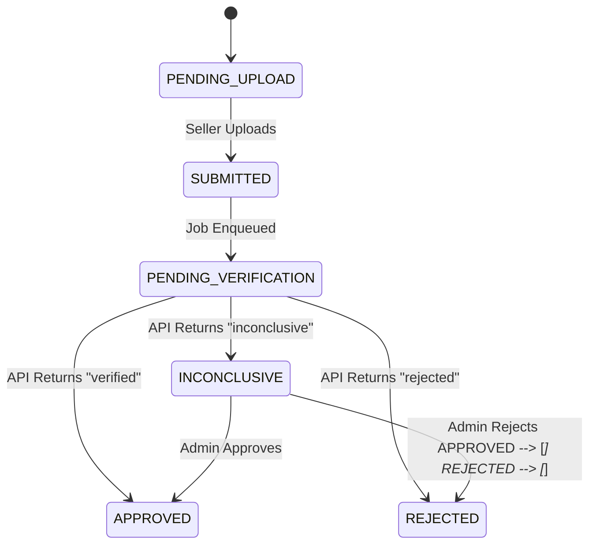

# Design document

## 1. Problem framing
The core problem for this feature of the platform is to balance between the truth, the verified and the user's convenience. The goal of the feature is to verify the identity of the seller, thus increase the legitimacy of the buyer in the seller and the platform's trustworthiness. Depend on the scale of the platform, the verification process could be simple or complex, strict or lenient, and can vary from a few requests per day to hundreds or thousands. 

The verification process should be designed in a way that it is efficient, effective, and user-friendly, while also ensuring the validity and accuracy of the information. If the process is too lengthy or complicated, it may discourage sellers from completing the verification, which could lead to a decrease in the number of verified sellers and a decrease in the overall trustworthiness of the platform. On the other hand, if the process is too lenient, it may allow fraudulent sellers to slip through, which could damage the reputation of the platform and lead to a loss of trust from buyers.

Stackholder and success:
- Sellers: They want to be verified quickly and easily so they can start selling. They also want to know the reason if their verification is rejected and have a chance to fix it.
- Admin: They want to only spend time on special cases, on case where manual actions are needed, on 'inconclusive' cases.
- Platform: They want the transparency. They want the trail, the audit so that if there's legal issue, they can provide the whole process: the documents, their verification, their current state (veried, rejected, in waiting for manual action...).

For that, the feature will not focus on:
- Document editor: There might be simple preview.
- Chat between users.
- The verification.

## 2. Clarifying Questions
1. What happens if two admins interact (open/view/verify or reject) the same "inconclusive" record at the same time?
2. What happens when the mock API (and in extend, the verify API) down?
3. Notification should be in UI only or SMS/email?
4. Documents are only in PDF or Word/Image/etc?
5. How to prevent mass-verified documents?
6. Should there be a 'Seen' status for the documents?
7. Can admin change the status (ex. Change a verified to denied or append)?
8. How do we store personal information?

## 3. Architecture
State machine:

Data model
- **Sellers**: `id`, `email`, `company_name`.
    
- **Documents**: `id`, `seller_id`, `file_url`, `status` (Enum), `current_attempt_id`.
    
- **VerificationAttempts**: `id`, `document_id`, `provider_status`, `admin_id` (nullable), `admin_decision`, `reason`, `created_at`, `updated_at`.
    
- **AuditLogs**: `id`, `attempt_id`, `action_taken`, `performed_by` (System/Admin ID), `timestamp`.
## 4. Stack Decisions
Backend: Node.js/Express. Quickly to put up a demo and simple to structure for a single-feature MVP. NestJS is rejected due to its complexity, overkill for a demo that needs to be finished soon.
Frontend: Next.js. For both Seller and Admin, because it's quickly to setup and has folder-based routing as default. React SPA would require some setup.
Database: Postgres. Relational structure is required for the complex audit history and state integrity. 
Async processing: pg-boss. Uses the existing PostgreSQL database as a queue, reducing infrastructure complexity for this demo.

## 5. Trade-offs and Decisions
## 6. Failure Modes
## 7. Descoped Items
## 8. Implementation Plan